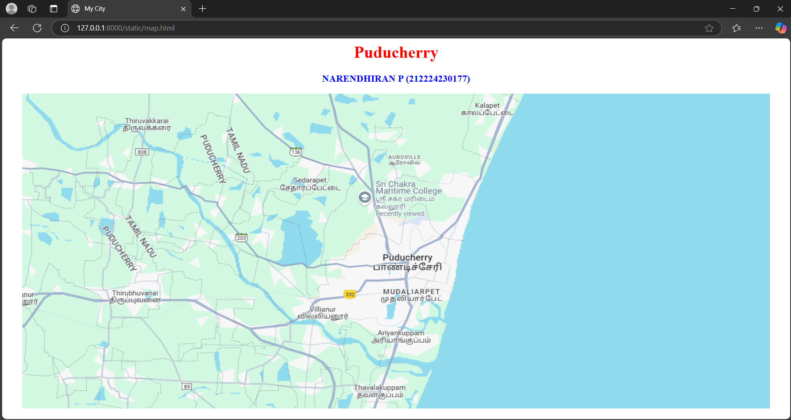
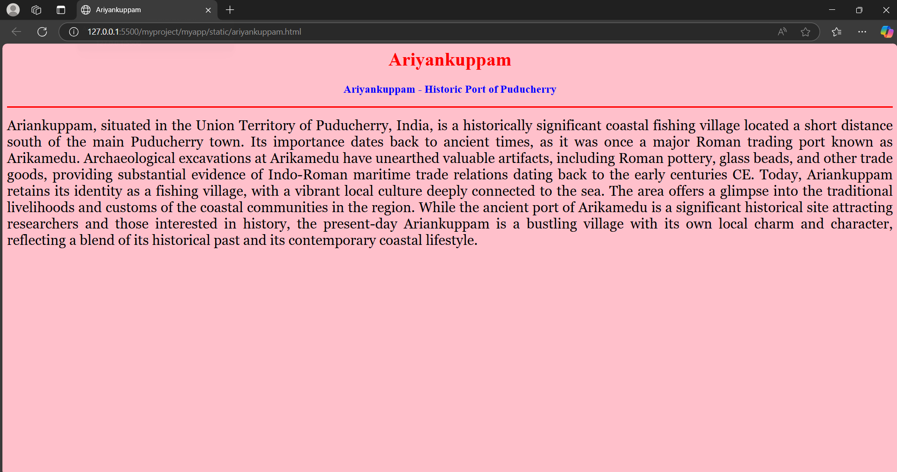
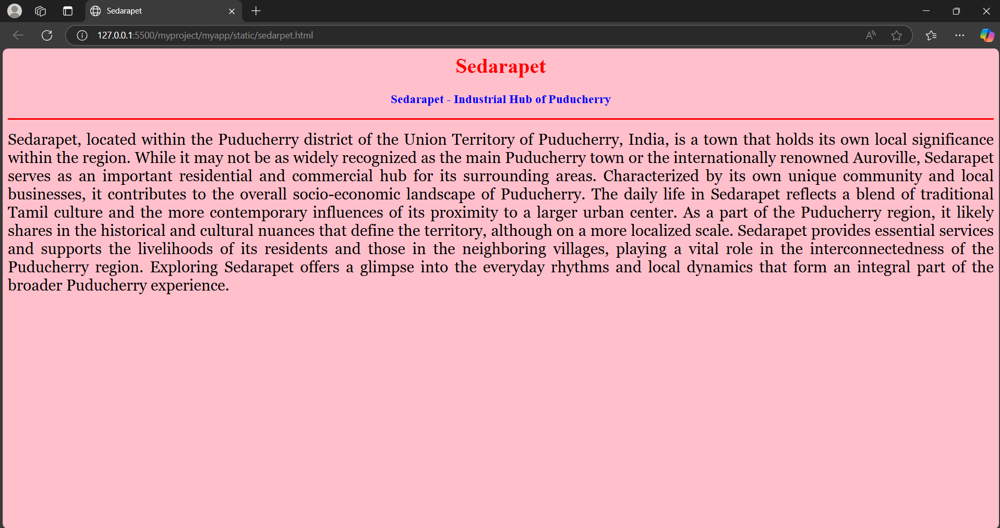
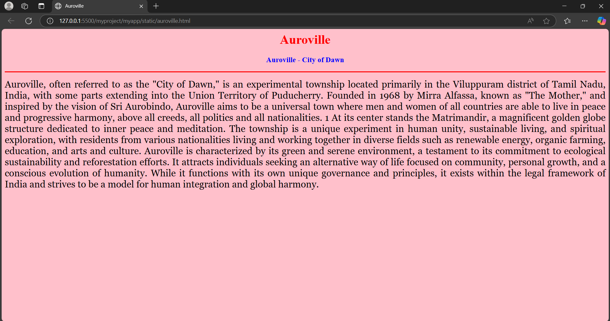
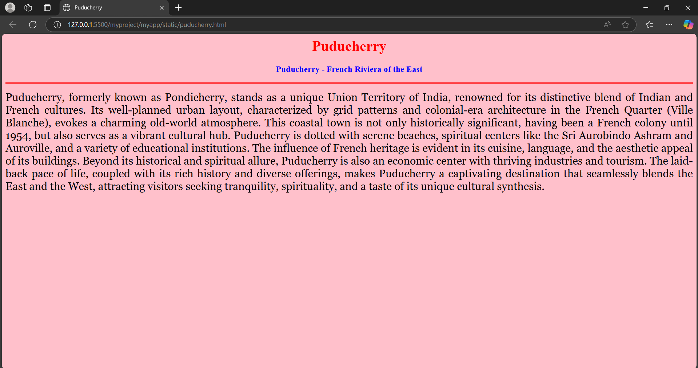
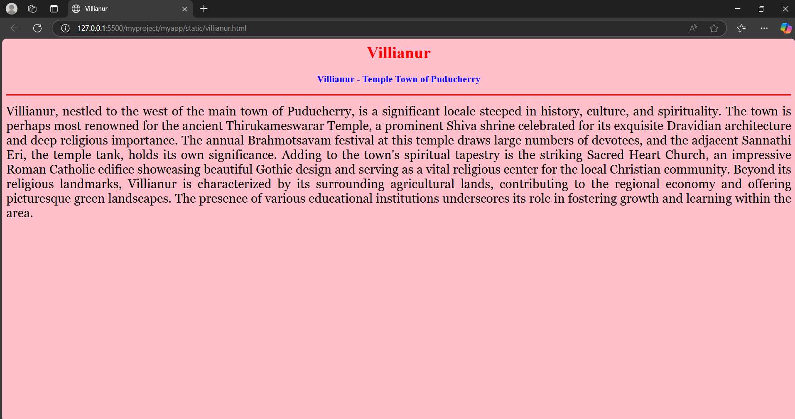

# Ex04 Places Around Me
## Date: 24/04/25 

## AIM
To develop a website to display details about the places around my house.

## DESIGN STEPS

### STEP 1
Create a Django admin interface.

### STEP 2
Download your city map from Google.

### STEP 3
Using ```<map>``` tag name the map.

### STEP 4
Create clickable regions in the image using ```<area>``` tag.

### STEP 5
Write HTML programs for all the regions identified.

### STEP 6
Execute the programs and publish them.

## CODE
### map.html
```html
<html>
<head>
  <title>My City</title>
</head>
<body>
  <h1 align="center">
    <font color="red"><b>Puducherry</b></font>
  </h1>
  <h3 align="center">
    <font color="blue"><b>NARENDHIRAN P (212224230177)</b></font>
  </h3>
  <center>
    
    <map name="MyCity">
      <area shape="rect" coords="656,284,733,332" href="puducherry.html" title="Puducherry" >
      <area shape="rect" coords="587,386,494,422" href="villianur.html" title="Villianur" >
      <area shape="rect" coords="433,187,550,150" href="sedarapet.html" title="Sedarapet" > 
      <area shape="rect" coords="608,343,734,385" href="mudaliarpet.html" title="Mudaliarpet" > 
      <area shape="rect" coords="650,101,734,136" href="auroville.html" title="Auroville" > 
      <area shape="rect" coords="594,428,739,464" href="ariyankuppam.html" title="Ariyankuppam" > 


      
    </map>
  </center>
</body>
</html>
```
### ariyankuppam.html
```html
<html>

<head>

  <title>Ariyankuppam</title>

</head>

<body bgcolor="pink">

  <h1 align="center">

    <font color="red"><b>Ariyankuppam</b></font>

  </h1>


  <h3 align="center">

    <font color="blue"><b>Ariyankuppam - Historic Port of Puducherry</b></font>

  </h3>


  <hr size="3" color="red">

  <p align="justify">

    <font face="Georgia" size="5">

        Ariankuppam, situated in the Union Territory of Puducherry, India, is a historically significant coastal fishing village located a short distance south of the main Puducherry town. Its importance dates back to ancient times, as it was once a major Roman trading port known as Arikamedu. Archaeological excavations at Arikamedu have unearthed valuable artifacts, including Roman pottery, glass beads, and other trade goods, providing substantial evidence of Indo-Roman maritime trade relations dating back to the early centuries CE. Today, Ariankuppam retains its identity as a fishing village, with a vibrant local culture deeply connected to the sea. The area offers a glimpse into the traditional livelihoods and customs of the coastal communities in the region. While the ancient port of Arikamedu is a significant historical site attracting researchers and those interested in history, the present-day Ariankuppam is a bustling village with its own local charm and character, reflecting a blend of its historical past and its contemporary coastal lifestyle.
    </font>

  </p>

</body>

</html>
```
### sedarpet.html
```html
<html>

<head>

  <title>Sedarapet</title>

</head>

<body bgcolor="pink">

  <h1 align="center">

    <font color="red"><b>Sedarapet</b></font>

  </h1>


  <h3 align="center">

    <font color="blue"><b>Sedarapet - Industrial Hub of Puducherry</b></font>

  </h3>


  <hr size="3" color="red">

  <p align="justify">

    <font face="Georgia" size="5">

        Sedarapet, located within the Puducherry district of the Union Territory of Puducherry, India, is a town that holds its own local significance within the region. While it may not be as widely recognized as the main Puducherry town or the internationally renowned Auroville, Sedarapet serves as an important residential and commercial hub for its surrounding areas. Characterized by its own unique community and local businesses, it contributes to the overall socio-economic landscape of Puducherry. The daily life in Sedarapet reflects a blend of traditional Tamil culture and the more contemporary influences of its proximity to a larger urban center. As a part of the Puducherry region, it likely shares in the historical and cultural nuances that define the territory, although on a more localized scale. Sedarapet provides essential services and supports the livelihoods of its residents and those in the neighboring villages, playing a vital role in the interconnectedness of the Puducherry region. Exploring Sedarapet offers a glimpse into the everyday rhythms and local dynamics that form an integral part of the broader Puducherry experience.
    </font>

  </p>

</body>

</html>
```
### auroville.html
```html
<html>

<head>

  <title>Auroville</title>

</head>

<body bgcolor="pink">

  <h1 align="center">

    <font color="red"><b>Auroville</b></font>

  </h1>


  <h3 align="center">

    <font color="blue"><b>Auroville - City of Dawn</b></font>

  </h3>


  <hr size="3" color="red">

  <p align="justify">

    <font face="Georgia" size="5">

        Auroville, often referred to as the "City of Dawn," is an experimental township located primarily in the Viluppuram district of Tamil Nadu, India, with some parts extending into the Union Territory of Puducherry. Founded in 1968 by Mirra Alfassa, known as "The Mother," and inspired by the vision of Sri Aurobindo, Auroville aims to be a universal town where men and women of all countries are able to live in peace and progressive harmony, above all creeds, all politics and all nationalities. 1  At its center stands the Matrimandir, a magnificent golden globe structure dedicated to inner peace and meditation. The township is a unique experiment in human unity, sustainable living, and spiritual exploration, with residents from various nationalities living and working together in diverse fields such as renewable energy, organic farming, education, and arts and culture. Auroville is characterized by its green and serene environment, a testament to its commitment to ecological sustainability and reforestation efforts. It attracts individuals seeking an alternative way of life focused on community, personal growth, and a conscious evolution of humanity. While it functions with its own unique governance and principles, it exists within the legal framework of India and strives to be a model for human integration and global harmony. 

    </font>

  </p>

</body>

</html>
```
### puducherry.html
```html
<html>

<head>

  <title>Puducherry</title>

</head>

<body bgcolor="pink">

  <h1 align="center">

    <font color="red"><b>Puducherry</b></font>

  </h1>


  <h3 align="center">

    <font color="blue"><b>Puducherry - French Riviera of the East</b></font>

  </h3>


  <hr size="3" color="red">

  <p align="justify">

    <font face="Georgia" size="5">

        Puducherry, formerly known as Pondicherry, stands as a unique Union Territory of India, renowned for its distinctive blend of Indian and French cultures. Its well-planned urban layout, characterized by grid patterns and colonial-era architecture in the French Quarter (Ville Blanche), evokes a charming old-world atmosphere. This coastal town is not only historically significant, having been a French colony until 1954, but also serves as a vibrant cultural hub. Puducherry is dotted with serene beaches, spiritual centers like the Sri Aurobindo Ashram and Auroville, and a variety of educational institutions. The influence of French heritage is evident in its cuisine, language, and the aesthetic appeal of its buildings. Beyond its historical and spiritual allure, Puducherry is also an economic center with thriving industries and tourism. The laid-back pace of life, coupled with its rich history and diverse offerings, makes Puducherry a captivating destination that seamlessly blends the East and the West, attracting visitors seeking tranquility, spirituality, and a taste of its unique cultural synthesis.
    </font>

  </p>

</body>

</html>
```

### villanur.html
```html
<html>

<head>

  <title>Villianur</title>

</head>

<body bgcolor="pink">

  <h1 align="center">

    <font color="red"><b>Villianur</b></font>

  </h1>


  <h3 align="center">

    <font color="blue"><b>Villianur - Temple Town of Puducherry</b></font>

  </h3>


  <hr size="3" color="red">

  <p align="justify">

    <font face="Georgia" size="5">

        Villianur, nestled to the west of the main town of Puducherry, is a significant locale steeped in history, culture, and spirituality. The town is perhaps most renowned for the ancient Thirukameswarar Temple, a prominent Shiva shrine celebrated for its exquisite Dravidian architecture and deep religious importance. The annual Brahmotsavam festival at this temple draws large numbers of devotees, and the adjacent Sannathi Eri, the temple tank, holds its own significance. Adding to the town's spiritual tapestry is the striking Sacred Heart Church, an impressive Roman Catholic edifice showcasing beautiful Gothic design and serving as a vital religious center for the local Christian community. Beyond its religious landmarks, Villianur is characterized by its surrounding agricultural lands, contributing to the regional economy and offering picturesque green landscapes. The presence of various educational institutions underscores its role in fostering growth and learning within the area. 
    </font>

  </p>

</body>

</html>
```
## OUTPUT














## RESULT
The program for implementing image maps using HTML is executed successfully.
